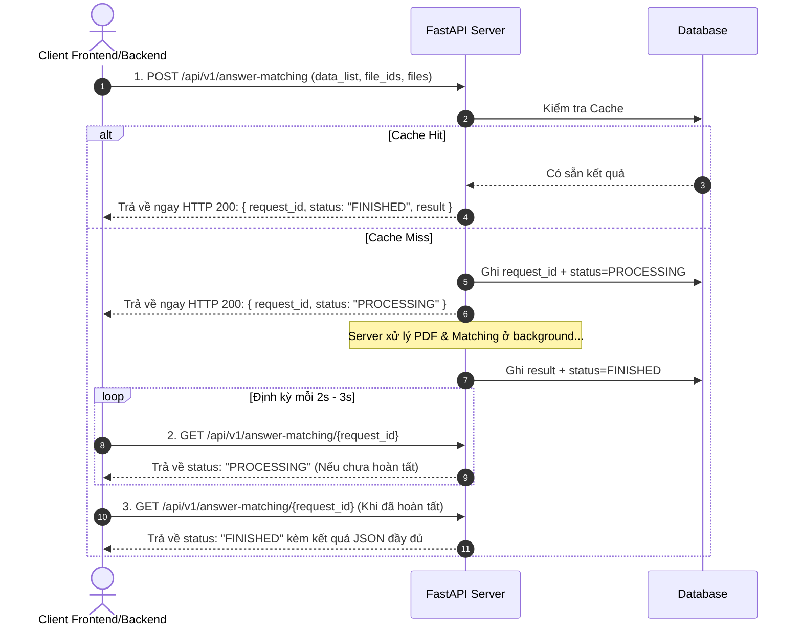
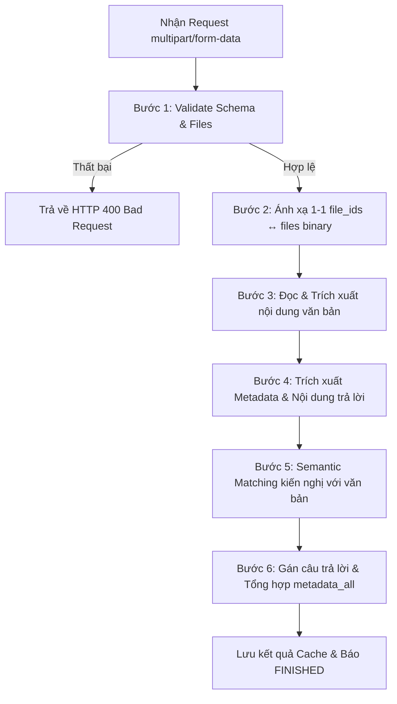

# TÀI LIỆU KỸ THUẬT API TRÍCH XUẤT & GHÉP NỐI VĂN BẢN TRẢ LỜI KIẾN NGHỊ CỬ TRI (AI ANSWER MATCHING)

Document Version: `2.0.0`  
Base URL: `https://<ai-service-host>/`  
Content-Type mặc định: `application/json` (trừ endpoint `/api/v1/answer-matching` dùng `multipart/form-data`)

---

## 1. TỔNG QUAN HỆ THỐNG

Hệ thống cung cấp API cho phép tiếp nhận danh sách kiến nghị cử tri từ Hệ thống Thông tin (HTTT) và danh sách các file văn bản trả lời (định dạng PDF) dưới dạng binary kèm danh sách `file_ids` tương ứng do HTTT quản lý.

Hệ thống AI Service thực hiện:

- Đọc và xử lý nội dung các file PDF văn bản trả lời (trích xuất text và OCR khi cần thiết).
- Trích xuất metadata của từng văn bản (`so_cong_van`, `ngay_ban_hanh`, `nguoi_ky`).
- Nhận diện và trích xuất nội dung câu trả lời tương ứng với từng kiến nghị (hỗ trợ trường hợp nội dung kiến nghị trong văn bản trả lời được diễn đạt lại/paraphrase).
- Thực hiện **Semantic Matching** (đối soát ngữ nghĩa) giữa kiến nghị cử tri và nội dung trả lời.
- Trả về danh sách kiến nghị kèm câu trả lời (`answers`), giữ nguyên `KN_KIENNGHI.ID`, gắn đúng `file_id` của file nguồn tương ứng để HTTT liên kết trực tiếp với file đã lưu trên MinIO.

API được thiết kế theo cơ chế **Bất đồng bộ (Asynchronous Processing)** kèm hỗ trợ **Cache thông minh** (dựa trên MD5/SHA256 Hash của các file và payload `data_list`).

### Phân quyền trách nhiệm

| Hệ thống          | Trách nhiệm chính                                                                                                                                                                                                                                                                                                                                                                                                                                 |
| :---------------- | :------------------------------------------------------------------------------------------------------------------------------------------------------------------------------------------------------------------------------------------------------------------------------------------------------------------------------------------------------------------------------------------------------------------------------------------------ |
| **HTTT (Client)** | • Nhận file văn bản trả lời từ người dùng.<br>• Upload và lưu trữ file trên MinIO.<br>• Sinh và quản lý `file_id` (định danh duy nhất cho từng file).<br>• Gửi request `multipart/form-data` chứa `data_list`, `file_ids`, `files` (binary) sang AI Service.<br>• Nhận kết quả từ AI Service và dùng `file_id` để liên kết với file trong MinIO.                                                                                                  |
| **AI Service**    | • Không truy cập trực tiếp MinIO của HTTT.<br>• Nhận file binary, `file_ids` và `data_list` qua API `multipart/form-data`.<br>• Đọc, OCR và trích xuất metadata + nội dung văn bản trả lời.<br>• Thực hiện Semantic Matching giữa kiến nghị và nội dung văn bản.<br>• Giữ nguyên tuyệt đối `KN_KIENNGHI.ID` và `file_id` do HTTT cung cấp.<br>• Trả về danh sách kiến nghị kèm `answers`, `metadata` văn bản và `metadata_all` thống kê tổng hợp. |

---

## 2. PHƯƠNG THỨC TÍCH HỢP (BẤT ĐỒNG BỘ QUA POLLING TRẠNG THÁI)

Client tương tác với AI Service theo mô hình Bất đồng bộ qua Polling trạng thái:



### Luồng hoạt động chi tiết:

1. Client gửi request `POST /api/v1/answer-matching` chứa danh sách kiến nghị và các file văn bản PDF.
2. Server tiếp nhận yêu cầu, đưa vào hàng đợi xử lý background và trả về ngay lập tức HTTP `200 OK` chứa `request_id` và trạng thái `PROCESSING`.
3. Client thiết lập timer/polling (ví dụ `setInterval` định kỳ mỗi 2-3 giây) gọi `GET /api/v1/answer-matching/{request_id}` để kiểm tra tiến độ.
4. Khi trường `status` chuyển thành `"FINISHED"`, response sẽ đi kèm object `result` chứa đầy đủ kết quả trích xuất và đối soát. Client dừng polling và hiển thị kết quả lên giao diện/lưu trữ cơ sở dữ liệu.

> **Lưu ý cơ chế Cache (Tối ưu trải nghiệm user)**:
> Hệ thống áp dụng Cache tự động. Khi người dùng tải lên cùng danh sách kiến nghị và các file văn bản trùng lặp đã từng xử lý thành công trước đó (dựa trên mã Hash của dữ liệu), Server sẽ trả về ngay trạng thái `FINISHED` cùng toàn bộ kết quả chỉ trong **vài miligiây** mà không cần chờ chạy lại AI Pipeline.

---

## 3. CHI TIẾT CÁC ENDPOINT API

### 1. Khởi Tạo Xử Lý & Ghép Nối Trả Lời (Upload Files & Data)

Tải danh sách kiến nghị cử tri và danh sách file văn bản trả lời (PDF) lên hệ thống để phân tích, trích xuất và đối soát ngữ nghĩa.

- **URL**: `/api/v1/answer-matching`
- **Method**: `POST`
- **Content-Type**: `multipart/form-data`

#### Request Parameters (Form Data):

| Parameter         | Type                         | Required | Description                                                                                             |
| :---------------- | :--------------------------- | :------- | :------------------------------------------------------------------------------------------------------ |
| `data_list`       | `string` (JSON String)       | **Có**   | Chuỗi JSON chứa danh sách kiến nghị cử tri cần tìm câu trả lời (xem chi tiết schema bên dưới).          |
| `file_ids`        | `string` (JSON Array String) | **Có**   | Chuỗi JSON Array chứa danh sách mã định danh file do HTTT quản lý. Ví dụ: `["FILE_001", "FILE_002"]`.   |
| `files`           | `file` (binary[])            | **Có**   | Danh sách file PDF văn bản trả lời. Định dạng `application/pdf`, dung lượng tối đa **30MB/file**.       |
| `force_reprocess` | `boolean`                    | Không    | Mặc định `false`. Nếu chọn `true`, ép buộc hệ thống chạy lại AI Pipeline mà không lấy kết quả từ Cache. |

#### Quy tắc Mapping `file_ids` ↔ `files`:

Hai danh sách `file_ids` và `files` được mapping 1-1 theo cùng thứ tự index:

```text
file_ids[0] ↔ files[0]
file_ids[1] ↔ files[1]
...
file_ids[n] ↔ files[n]
```

> **Lưu ý quan trọng**:
>
> - Số lượng phần tử trong `file_ids` bắt buộc phải **bằng chính xác** số lượng file trong `files`.
> - AI Service giữ nguyên `file_id` và sử dụng đúng `file_id` khi trả kết quả trong `answers`.

#### Cấu trúc Schema `data_list` trong Form Data:

```json
{
  "data_list": [
    {
      "KN_KIENNGHI.ID": 123,
      "KN_KIENNGHI.DONVI_TIEPNHAN": 101,
      "KN_KIENNGHI.NOI_DUNG": "Kiến nghị về việc cải thiện chất lượng đường giao thông tuyến Quốc lộ 18A..."
    },
    {
      "KN_KIENNGHI.ID": 124,
      "KN_KIENNGHI.DONVI_TIEPNHAN": 102,
      "KN_KIENNGHI.NOI_DUNG": "Đề nghị hỗ trợ người dân trong việc hoàn thiện thủ tục cấp giấy chứng nhận quyền sử dụng đất..."
    }
  ]
}
```

| Field                        | Type      | Required | Mô tả                                                                            |
| :--------------------------- | :-------- | :------- | :------------------------------------------------------------------------------- |
| `KN_KIENNGHI.ID`             | `integer` | **Có**   | ID duy nhất của kiến nghị trong HTTT. Khóa tham chiếu để HTTT nhận diện kết quả. |
| `KN_KIENNGHI.DONVI_TIEPNHAN` | `integer` | **Có**   | ID địa phương / đơn vị tiếp nhận kiến nghị.                                      |
| `KN_KIENNGHI.NOI_DUNG`       | `string`  | **Có**   | Nội dung chi tiết của kiến nghị cử tri.                                          |

#### Request Example (cURL):

```bash
curl -X POST "http://localhost:8077/api/v1/answer-matching" \
  -H "accept: application/json" \
  -F 'data_list={"data_list":[{"KN_KIENNGHI.ID":123,"KN_KIENNGHI.DONVI_TIEPNHAN":101,"KN_KIENNGHI.NOI_DUNG":"Kiến nghị về việc nâng cấp tuyến Quốc lộ 18A"},{"KN_KIENNGHI.ID":124,"KN_KIENNGHI.DONVI_TIEPNHAN":102,"KN_KIENNGHI.NOI_DUNG":"Đề nghị hỗ trợ cấp sổ đỏ..."}]};type=application/json' \
  -F 'file_ids=["FILE_001","FILE_002"];type=application/json' \
  -F "files=@./van_ban_tra_loi_01.pdf;type=application/pdf" \
  -F "files=@./van_ban_tra_loi_02.pdf;type=application/pdf" \
  -F "force_reprocess=false"
```

#### Response Example (200 OK - Khi đang tiếp nhận & xử lý):

```json
{
  "request_id": "c7a812ef-29b1-4b16-9ef0-0a568b209d84",
  "status": "PROCESSING"
}
```

#### Response Example (200 OK - Khi Cache Hit / Trả về kết quả ngay):

```json
{
  "request_id": "c7a812ef-29b1-4b16-9ef0-0a568b209d84",
  "status": "FINISHED",
  "result": {
    "data_list": [
      {
        "KN_KIENNGHI.ID": 123,
        "answers": [
          {
            "content": "Bộ Giao thông vận tải đã chỉ đạo các đơn vị liên quan phối hợp với UBND tỉnh rà soát và đưa vào kế hoạch đầu tư công trung hạn giai đoạn tới để nâng cấp tuyến Quốc lộ 18A...",
            "file_id": "FILE_001",
            "metadata": {
              "so_cong_van": "8140/BGTVT-VP",
              "ngay_ban_hanh": "18/06/2026",
              "nguoi_ky": "Nguyễn Văn A"
            }
          }
        ]
      },
      {
        "KN_KIENNGHI.ID": 124,
        "answers": []
      }
    ],
    "metadata_all": {
      "matched_count": 1,
      "unmatched_count": 1
    }
  }
}
```

---

### 2. Kiểm Tra Trạng Thái & Lấy Kết Quả (Polling)

Sử dụng định kỳ để kiểm tra tiến độ xử lý và lấy toàn bộ kết quả sau khi hoàn tất.

- **URL**: `/api/v1/answer-matching/{request_id}`
- **Method**: `GET`
- **URL Parameters**:
  - `request_id` (string, required): Mã định danh công việc được trả về từ `POST /api/v1/answer-matching`.

#### Response Example (Đang xử lý - 200 OK):

```json
{
  "request_id": "c7a812ef-29b1-4b16-9ef0-0a568b209d84",
  "status": "PROCESSING"
}
```

#### Response Example (Đã hoàn tất - 200 OK):

```json
{
  "request_id": "c7a812ef-29b1-4b16-9ef0-0a568b209d84",
  "status": "FINISHED",
  "result": {
    "data_list": [
      {
        "KN_KIENNGHI.ID": 123,
        "answers": [
          {
            "content": "Bộ Giao thông vận tải đã chỉ đạo các đơn vị liên quan phối hợp với UBND tỉnh rà soát và đưa vào kế hoạch đầu tư công trung hạn giai đoạn tới để nâng cấp tuyến Quốc lộ 18A...",
            "file_id": "FILE_001",
            "metadata": {
              "so_cong_van": "8140/BGTVT-VP",
              "ngay_ban_hanh": "18/06/2026",
              "nguoi_ky": "Nguyễn Văn A"
            }
          }
        ]
      },
      {
        "KN_KIENNGHI.ID": 124,
        "answers": []
      }
    ],
    "metadata_all": {
      "matched_count": 1,
      "unmatched_count": 1
    }
  }
}
```

#### Response Example (Thất bại - 200 OK):

```json
{
  "request_id": "c7a812ef-29b1-4b16-9ef0-0a568b209d84",
  "status": "FAILED",
  "error": "Lỗi xử lý: Định dạng file PDF không hợp lệ hoặc không thể OCR/trích xuất nội dung."
}
```

---

### 3. Kiểm Tra Tình Trạng Hệ Thống (Health Check)

- **URL**: `/health`
- **Method**: `GET`

#### Response Example (200 OK):

```json
{
  "status": "ok"
}
```

---

## 4. LOGIC NGHIỆP VỤ XỬ LÝ (PROCESSING PIPELINE)



### Bước 1 — Validate Request

AI Service kiểm tra:

- `data_list`, `file_ids` và `files` tồn tại trong request.
- `data_list` đúng schema định nghĩa; mỗi kiến nghị có đủ `KN_KIENNGHI.ID`, `KN_KIENNGHI.DONVI_TIEPNHAN`, `KN_KIENNGHI.NOI_DUNG`.
- Số lượng phần tử trong mảng `file_ids` bắt buộc phải bằng chính xác số lượng file trong `files`.
- Định dạng các file upload phải là PDF và dung lượng `<= 30MB/file`.
- Nếu validation thất bại → Trả ngay HTTP `400 Bad Request` kèm chi tiết lỗi.

### Bước 2 — Mapping File Nội Bộ

Tạo ánh xạ nội bộ giữa `file_id` và file binary:

```text
file_id → file binary
```

Ví dụ:

```text
FILE_001 → van_ban_tra_loi_01.pdf
FILE_002 → van_ban_tra_loi_02.pdf
```

### Bước 3 — Đọc và Trích Xuất Nội Dung

AI Service đọc từng file PDF, bóc tách cấu trúc văn bản và trích xuất nội dung.

### Bước 4 — Trích Xuất Metadata Văn Bản & Phân Tách Khối Nội Dung

Từ các văn bản trả lời, AI xác định:

- **Metadata văn bản**: `so_cong_van`, `ngay_ban_hanh` (định dạng `DD/MM/YYYY`), `nguoi_ky` (nếu trường nào không trích xuất được thì gán `null`).
- Tách các đoạn nội dung kiến nghị được trích dẫn lại và nội dung trả lời/giải quyết tương ứng.
- Gắn với `file_id` của file nguồn tương ứng.

### Bước 5 — Semantic Matching (Đối Soát Ngữ Nghĩa)

AI Service đối soát ngữ nghĩa giữa từng kiến nghị trong `data_list` với các nội dung trả lời trong văn bản:

```text
KN_KIENNGHI.NOI_DUNG (Kiến nghị từ HTTT)
                  ↕ (Semantic Matching)
Nội dung kiến nghị & giải đáp được đề cập trong văn bản trả lời
```

_Không yêu cầu hai đoạn văn bản giống nhau 100% về mặt từ ngữ. Hệ thống sử dụng mô hình ngôn ngữ lớn (LLM/Embedding) để nhận diện các câu hỏi được viết lại/paraphrase có cùng bản chất ngữ nghĩa._

### Bước 6 — Gán Câu Trả Lời & Tổng Hợp Kết Quả

- Mỗi kiến nghị trong `data_list` đầu vào đều phải xuất hiện trong `data_list` của kết quả với đúng `KN_KIENNGHI.ID`.
- Mỗi kiến nghị có mảng `answers` chứa tối đa 1 câu trả lời (`maxItems: 1`):
  - Nếu **tìm thấy** câu trả lời: `answers` chứa 1 object gồm `content`, `file_id` (ID của file nguồn tương ứng) và `metadata`.
  - Nếu **không tìm thấy** câu trả lời: `answers` là mảng rỗng `[]`.
- Tổng hợp `metadata_all`:
  - `matched_count`: Tổng số kiến nghị tìm thấy câu trả lời (`answers` có phần tử).
  - `unmatched_count`: Tổng số kiến nghị chưa tìm thấy câu trả lời (`answers` rỗng).

---

## 5. CHI TIẾT CẤU TRÚC DỮ LIỆU PHẢN HỒI (RESPONSE SCHEMA)

| Thuộc tính                                     | Kiểu dữ liệu       | Bắt buộc | Mô tả                                                                                                                    |
| :--------------------------------------------- | :----------------- | :------- | :----------------------------------------------------------------------------------------------------------------------- |
| `data_list`                                    | `array`            | **Có**   | Danh sách kết quả ghép nối cho từng kiến nghị cử tri. Kiến nghị không tìm thấy câu trả lời vẫn có mặt với `answers: []`. |
| `data_list[].KN_KIENNGHI.ID`                   | `integer`          | **Có**   | ID duy nhất của kiến nghị trong HTTT (AI giữ nguyên giá trị nhận được).                                                  |
| `data_list[].answers`                          | `array`            | **Có**   | Danh sách câu trả lời tương ứng (tối đa 1 phần tử). Mảng rỗng `[]` nếu không tìm thấy.                                   |
| `data_list[].answers[].content`                | `string`           | **Có**   | Nội dung chi tiết câu trả lời trích xuất từ văn bản.                                                                     |
| `data_list[].answers[].file_id`                | `string`           | **Có**   | ID của file nguồn chứa câu trả lời do HTTT cung cấp ban đầu.                                                             |
| `data_list[].answers[].metadata`               | `object`           | **Có**   | Thông tin metadata của văn bản trả lời.                                                                                  |
| `data_list[].answers[].metadata.so_cong_van`   | `string` \| `null` | **Có**   | Số công văn của văn bản (ví dụ: `"8140/BGTVT-VP"`).                                                                      |
| `data_list[].answers[].metadata.ngay_ban_hanh` | `string` \| `null` | **Có**   | Ngày ban hành văn bản theo định dạng `DD/MM/YYYY` (ví dụ: `"18/06/2026"`).                                               |
| `data_list[].answers[].metadata.nguoi_ky`      | `string` \| `null` | **Có**   | Họ tên người ký văn bản (ví dụ: `"Nguyễn Văn A"`).                                                                       |
| `metadata_all`                                 | `object`           | **Có**   | Thống kê tổng hợp kết quả ghép nối.                                                                                      |
| `metadata_all.matched_count`                   | `integer`          | **Có**   | Số lượng kiến nghị tìm thấy câu trả lời (`answers` có phần tử).                                                          |
| `metadata_all.unmatched_count`                 | `integer`          | **Có**   | Số lượng kiến nghị chưa tìm thấy câu trả lời (`answers` rỗng).                                                           |

---

## 6. MÃ LỖI HTTP & THÔNG BÁO LỖI (ERROR HANDLING)

API sử dụng các mã trạng thái HTTP chuẩn để thông báo kết quả:

| HTTP Code                        | Exception / Status   | Nguyên nhân & Hướng xử lý cho Frontend / Client                                                                                                           |
| :------------------------------- | :------------------- | :-------------------------------------------------------------------------------------------------------------------------------------------------------- |
| **`200 OK`**                     | Success              | Request được tiếp nhận và xử lý thành công (Kiểm tra trường `status` để biết tiến độ).                                                                    |
| **`400 Bad Request`**            | Validation Error     | Dữ liệu gửi lên không đúng định dạng (JSON lỗi trong `data_list`/`file_ids`, số lượng `file_ids` không khớp số lượng `files`, thiếu các trường bắt buộc). |
| **`404 Not Found`**              | Request ID Not Found | `request_id` truyền vào không tồn tại trong hệ thống.                                                                                                     |
| **`413 Payload Too Large`**      | File Size Exceeded   | Dung lượng file PDF vượt quá giới hạn **30MB/file**. Client cần validate dung lượng file trước khi gửi.                                                   |
| **`415 Unsupported Media Type`** | Invalid File Format  | File tải lên không đúng định dạng `application/pdf`. Client chỉ cho phép upload file `.pdf`.                                                              |
| **`500 Internal Server Error`**  | Server Error         | Lỗi hệ thống nội bộ hoặc lỗi không thể phục hồi trong AI Pipeline.                                                                                        |

---
