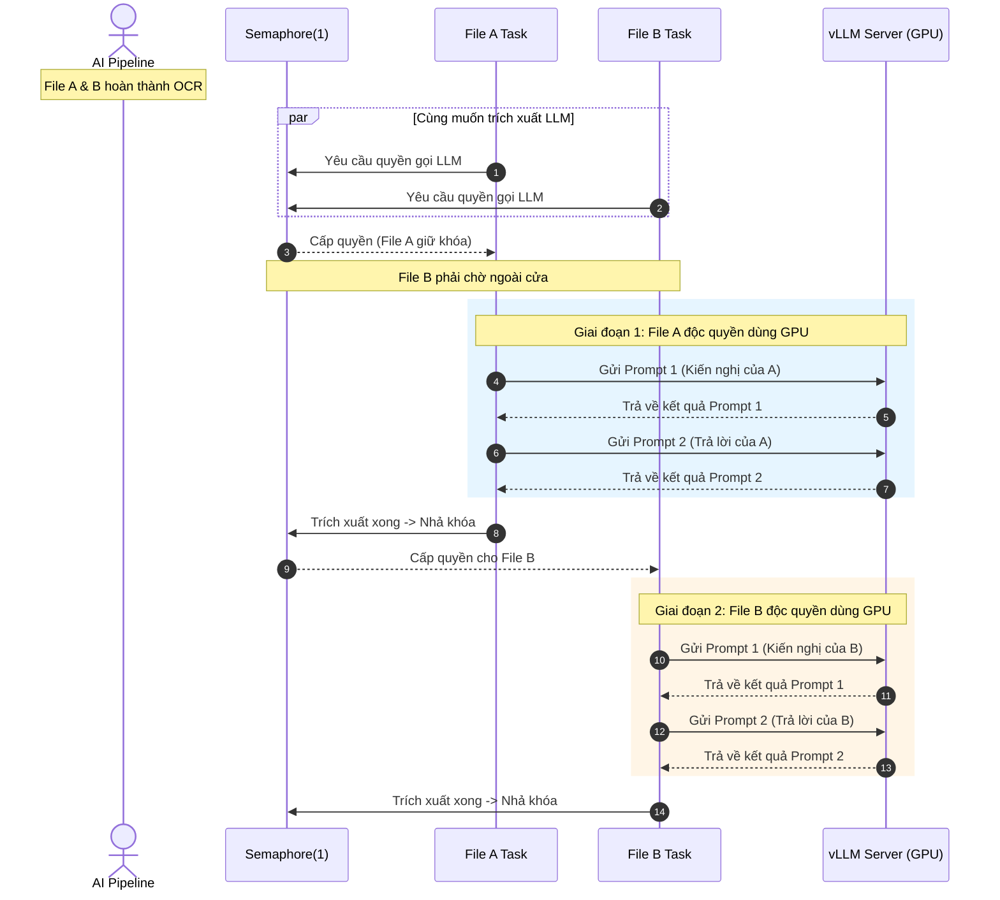

# Cơ chế Điều phối Concurrency và Kiểm soát VRAM GPU trong Answer Matching v2

Tài liệu này giải thích chi tiết cách hệ thống quản lý đồng thời (concurrency), cơ chế khóa **`Semaphore(1)`** cho tầng LLM Fallback, và trình tự GPU xử lý từng request giữa các file và các prompt nhằm đảm bảo an toàn tuyệt đối cho bộ nhớ VRAM.

---

## 1. Bản chất Vấn đề & Áp lực VRAM lên GPU

Khi chạy mô hình ngôn ngữ lớn (như `google/gemma-4-26B-it`) trên inference engine (vLLM):
- **Trọng số mô hình (Weights):** Chiếm dung lượng VRAM cố định.
- **Bộ nhớ đệm KV Cache:** Phình to động theo **số lượng request đồng thời** và **chiều dài văn bản** (Prompt tokens + Generation tokens).

Nếu gửi nhiều file cùng lúc và để tất cả các file tự do bắn requests sang LLM server:
- vLLM phải cấp phát KV Cache song song cho nhiều request nặng $\rightarrow$ **Dễ gây tràn bộ nhớ VRAM (CUDA Out-of-Memory)** hoặc làm rớt kết nối (`Connection error`).

---

## 2. Thiết kế Giải pháp: Semaphore(1) & Chạy Tuần tự 2 Prompt

Hệ thống kết hợp 2 lớp kiểm soát:
1. **Bên trong mỗi file ([`llm_chunking.py`](file:///home/jovyan/scratch/quangdm/ea_api_with_metadata_v2/llm_chunking.py)):** Chạy tuần tự Prompt 1 (Kiến nghị) xong rồi mới chạy Prompt 2 (Trả lời).
2. **Giữa các file với nhau ([`functions.py`](file:///home/jovyan/scratch/quangdm/ea_api_with_metadata_v2/functions.py)):** Đặt một khóa cổng `Semaphore(1)` bọc quanh hàm `_extract_llm`.

```python
# functions.py
sem = _get_llm_semaphore()  # Semaphore(LLM_CONCURRENCY = 1)
async with sem:             # <--- FILE BẮT ĐẦU GIỮ KHÓA
    result = await extract_from_md(md_text, file_name="document")
    # Trong hàm này:
    # 1. raw_kn = await _call_llm(Prompt 1)
    # 2. raw_tl = await _call_llm(Prompt 2)
# <--- FILE HOÀN THÀNH XONG CẢ 2 PROMPT MỚI NHẢ KHÓA
```

---

## 3. Trình tự Xử lý Thực tế: Prompt nào chạy trước, của File nào?

Khi người dùng gửi lên nhiều file (ví dụ **File A** và **File B**) và cả 2 đều thuộc nhóm cần dùng LLM (như Bộ Công Thương):



### Các bước diễn ra trên GPU theo trục thời gian:
1. **File A** nhận chìa khóa `Semaphore(1)` trước $\rightarrow$ Khóa cửa lại.
2. **GPU xử lý request 1:** Prompt 1 (Kiến nghị) của **File A**.
3. File A nhận kết quả Prompt 1, **vẫn tiếp tục giữ khóa**.
4. **GPU xử lý request 2:** Prompt 2 (Trả lời) của **File A**.
5. File A xong xuôi cả 2 prompt $\rightarrow$ **Nhả chìa khóa Semaphore**.
6. **File B** (vốn đang đứng chờ ngoài cửa) lúc này mới nhận chìa khóa và bước vào.
7. **GPU xử lý request 3:** Prompt 1 (Kiến nghị) của **File B**.
8. **GPU xử lý request 4:** Prompt 2 (Trả lời) của **File B**.

$$\text{Prompt 1 (A)} \longrightarrow \text{Prompt 2 (A)} \longrightarrow \text{Prompt 1 (B)} \longrightarrow \text{Prompt 2 (B)}$$

---

## 4. Kết luận & Ưu điểm Thiết kế

- **Prompt của File B KHÔNG BAO GIỜ chen ngang** vào giữa Prompt 1 và Prompt 2 của File A.
- **Tải VRAM tối thiểu:** Tại bất kỳ thời điểm nào, GPU chỉ phục vụ **đúng 1 request đơn lẻ**. Không có hiện tượng dồn ứ hàng đợi hay KV Cache phình to đột ngột.
- **Không ảnh hưởng các file chuẩn (F1/F2/F3):** Các file văn bản nhận diện được regex (như Bộ Tài chính, Y tế, Xây dựng,...) không đi qua hàm `_extract_llm` nên không bị vướng Semaphore, vẫn được xử lý song song tốc độ cao.
