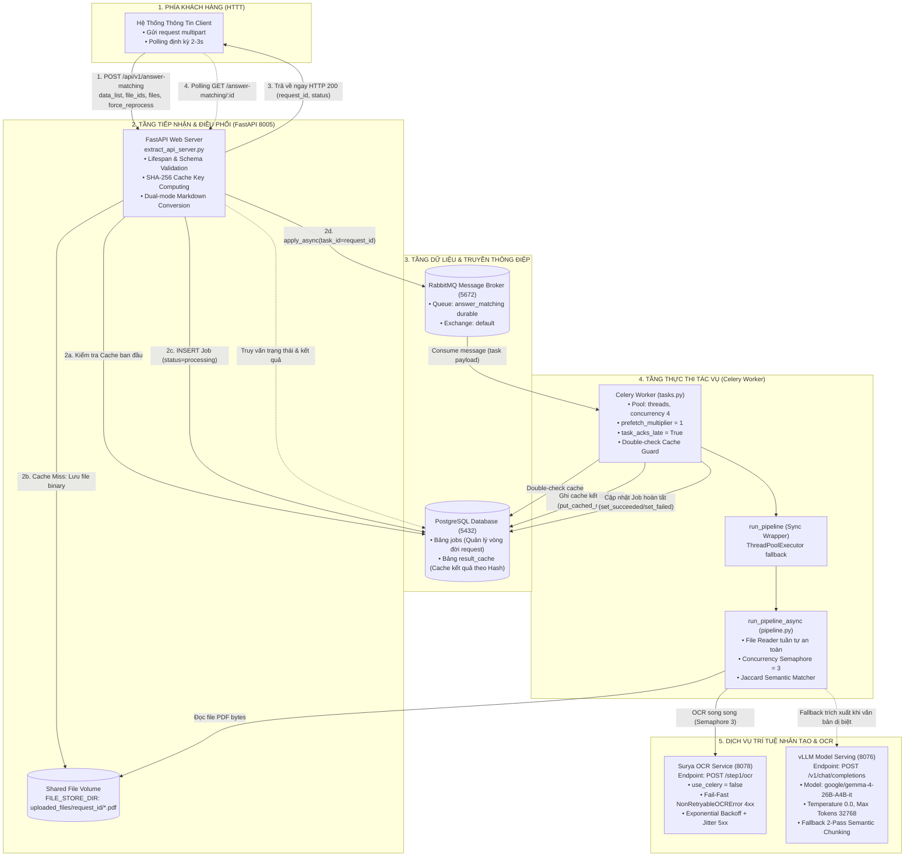
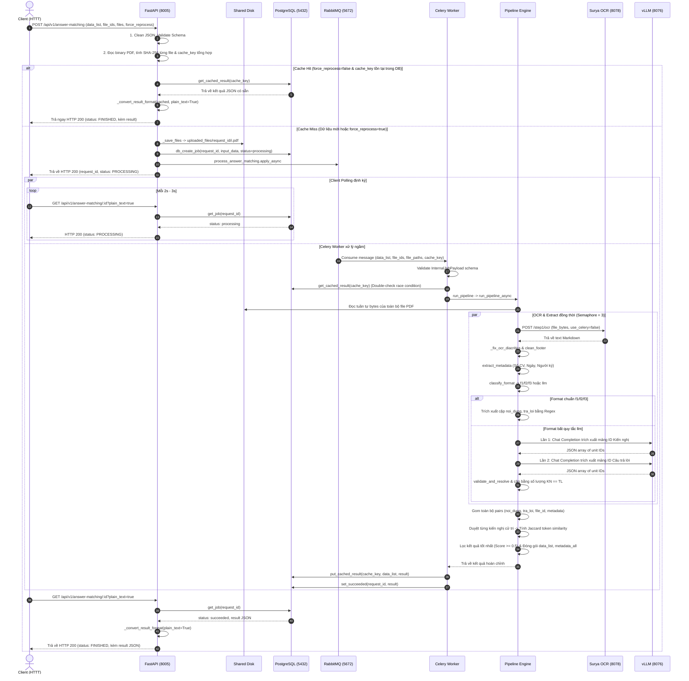
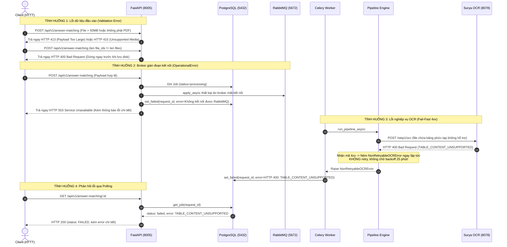
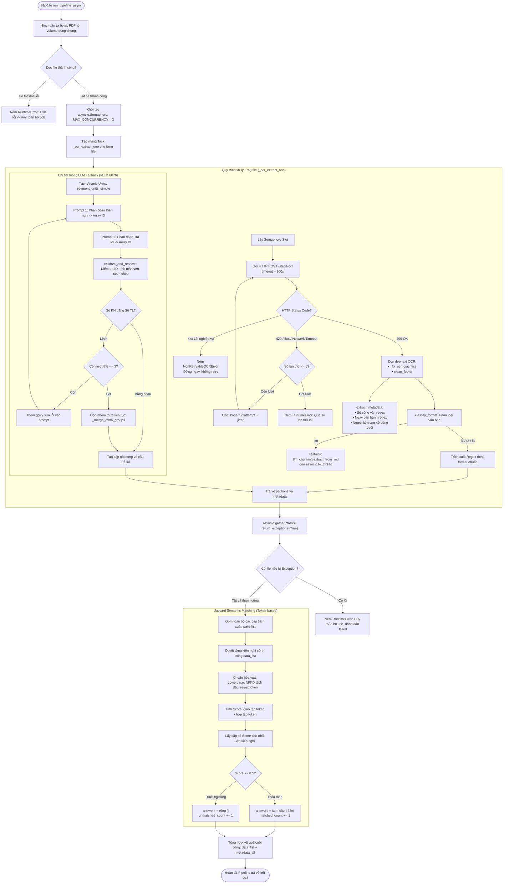

# SƠ ĐỒ VÀ ĐẶC TẢ KỸ THUẬT TOÀN DIỆN HỆ THỐNG HIỆN TẠI (ANSWER MATCHING API V2)

- **Phiên bản hệ thống:** `2.2.0`
- **Thời gian cập nhật:** 17/09/2026
- **Nhánh Git triển khai:** `fix/async-ocr-pipeline`
- **Các file mã nguồn cốt lõi:**
  - API Layer: `extract_api_server.py`, `schemas.py`
  - Task & Queue: `tasks.py`, `worker.sh`
  - Database & Cache: `db.py`
  - AI Pipeline: `pipeline.py`, `functions.py`, `regexes.py`, `llm_chunking.py`, `postprocess.py`

---

## 1. TỔNG QUAN KIẾN TRÚC TOÀN CẢNH (ARCHITECTURE OVERVIEW)

Hệ thống Answer Matching v2 vận hành theo mô hình **Bất đồng bộ hướng sự kiện (Event-Driven Asynchronous Architecture)** kết hợp cơ chế **Cache hai lớp (Double-check Cache)** và **Hàng đợi tác vụ phân tán (Distributed Task Queue)**:



### Bảng chi tiết cấu hình và cổng giao tiếp kỹ thuật:

| Thành phần | File mã nguồn | Port / Giao thức | Cấu hình & Trách nhiệm kỹ thuật cốt lõi |
| :--- | :--- | :--- | :--- |
| **FastAPI Server** | `extract_api_server.py` | `8005` (HTTP) | • Tiền xử lý: BOM removal, Smart quotes sanitization, Markdown strip.<br/>• Validate kích thước file (`MAX_FILE_SIZE_MB = 50MB`), đuôi `.pdf`.<br/>• Sinh `cache_key = SHA256(file_ids + file_bytes_hashes + data_list)`.<br/>• Quản lý file trên volume dùng chung `./uploaded_files/{request_id}/`. |
| **PostgreSQL** | `db.py` | `5432` (TCP) | • `jobs`: Quản lý trạng thái xử lý (`processing`, `succeeded`, `failed`).<br/>• `result_cache`: Lưu trữ kết quả JSON theo `cache_key`.<br/>• Connection pool: SQLAlchemy `create_engine` với `SessionLocal`. |
| **RabbitMQ** | `docker-compose.yml` | `5672` (AMQP) | • Queue bền vững (`durable`): `answer_matching`.<br/>• Điều phối tác vụ từ API sang Worker, chống nghẽn bộ nhớ. |
| **Celery Worker** | `tasks.py`, `worker.sh` | Chạy tiến trình nền | • Lệnh khởi chạy: `celery -A tasks worker -Q answer_matching --pool=threads -c 4 --loglevel=info --detach`.<br/>• `worker_prefetch_multiplier = 1`: Tránh kéo dồn task nặng.<br/>• `task_acks_late = True`: Task chỉ được ACK khi xử lý xong hoàn toàn.<br/>• Double-check cache trước khi gọi pipeline. |
| **AI Pipeline** | `pipeline.py`, `functions.py` | In-process Python | • Điều phối bất đồng bộ `run_pipeline_async`.<br/>• `asyncio.Semaphore(3)`: Giới hạn tối đa 3 file OCR đồng thời.<br/>• Bộ định tuyến phân loại văn bản `classify_format`: F1, F2, F3 (Regex) hoặc Fallback LLM. |
| **Surya OCR Server** | Dịch vụ ngoài | `8078` (HTTP) | • URL: `http://127.0.0.1:8078/step1/ocr`.<br/>• Header: `use_celery="false"` (chạy in-process trực tiếp trên server OCR).<br/>• Cơ chế Fail-Fast lỗi 4xx (`NonRetryableOCRError`), Retry 5 lần lỗi 5xx. |
| **vLLM Engine** | Dịch vụ ngoài | `8076` (HTTP) | • URL: `http://127.0.0.1:8076/v1` (tương thích OpenAI API).<br/>• Model: `google/gemma-4-26B-A4B-it`, `max_tokens=32768`.<br/>• 2-Pass Semantic Chunking phân đoạn kiến nghị và câu trả lời. |

---

## 2. SƠ ĐỒ TUẦN TỰ HOẠT ĐỘNG (SEQUENCE DIAGRAMS)

### 2.1. Luồng chuẩn thành công (Bao gồm Cache Hit & Polling Asynchronous)



---

### 2.2. Sơ đồ xử lý ngoại lệ và cơ chế Fail-Fast (Failure & Error Recovery)

Hệ thống thiết lập các rào chắn kỹ thuật nhằm phát hiện và cô lập lỗi ngay lập tức, ngăn ngừa hiện tượng treo queue hay lãng phí tài nguyên tính toán:



---

## 3. SƠ ĐỒ & ĐẶC TẢ CHI TIẾT AI PIPELINE (`pipeline.py`, `functions.py`, `llm_chunking.py`)

### 3.1. Sơ đồ luồng xử lý nội bộ Pipeline



---

### 3.2. Cơ chế phân loại định dạng văn bản (`classify_format`)

Hàm `classify_format(md_text)` quét cấu trúc Markdown đã qua OCR và phân loại theo 4 nhánh:

1. **Format `f1` (Đơn kiến nghị đơn mục):**
   - Tài liệu chỉ chứa **1 mục S1** ("Nội dung kiến nghị") và **1 mục S2** ("Kết quả nghiên cứu, giải quyết và trả lời").
   - Trong vùng giữa S1 và S2 có ít hơn 2 mục con đánh số.
   - *Quy tắc bóc tách:* Lấy toàn bộ đoạn giữa S1 và S2 làm `noi_dung`; toàn bộ đoạn sau S2 đến phần kết thư làm `tra_loi`.
2. **Format `f2` (Đa kiến nghị theo từng mục độc lập):**
   - Tài liệu chứa nhiều cặp S1 và S2 được phân cách bởi các Group Header (`I. Kiến nghị số...`, `1. Đối với kiến nghị...`).
   - *Quy tắc bóc tách:* Duyệt qua từng S2, tìm S1 gần nhất phía trước nó và xác định biên kết thúc bằng `GROUP_RE`, `END_RE`, `CLOSING_RE` hoặc `TRACH_NHIEM_RE`.
3. **Format `f3` (Kiến nghị gom nhóm đầu thư, trả lời phân đoạn ở sau):**
   - Có 1 mục S1 và 1 mục S2, nhưng bên trong vùng S1 liệt kê từ 2 kiến nghị trở lên (`1. Cử tri kiến nghị...`, `2. Cử tri phản ánh...`).
   - Vùng sau S2 chia thành các tiêu đề đánh số tương ứng (`2.1. Về nội dung...`, `2.2. Đối với kiến nghị...`).
   - *Quy tắc bóc tách:* Tách danh sách item trong S1 (`_split_items`) và map 1-1 với các block trả lời trong S2 (`_split_answer_blocks`).
4. **Format `llm` (Văn bản dị biệt không theo quy chuẩn S1/S2):**
   - Áp dụng khi không tìm thấy tiêu đề S1 hoặc S2 hợp lệ.
   - Hệ thống chuyển sang cơ chế Fallback LLM Semantic Chunking trên vLLM (`llm_chunking.py`).

---

### 3.3. Giải thuật Jaccard Semantic Matching

Sau khi trích xuất toàn bộ các cặp câu trả lời từ các file PDF, hệ thống tiến hành đối soát ngữ nghĩa giữa từng kiến nghị trong `data_list` với các câu trả lời:

1. **Chuẩn hóa chuỗi (`_normalize`):**
   ```python
   def _normalize(text: str) -> set[str]:
       text = (text or "").lower()
       # Khử dấu tiếng Việt qua NFKD
       text = "".join(c for c in unicodedata.normalize("NFKD", text) if not unicodedata.combining(c))
       # Lấy danh sách token chữ và số
       return set(re.findall(r"[a-z0-9]+", text))
   ```
2. **Hệ số tương đồng Jaccard (`_jaccard`):**
   $$\text{Jaccard}(A, B) = \frac{|Tokens(A) \cap Tokens(B)|}{|Tokens(A) \cup Tokens(B)|}$$
3. **Ngưỡng quyết định (`JACCARD_THRESHOLD = 0.5`):**
   - Với mỗi kiến nghị cử tri $K$, tìm câu trả lời $P^*$ sao cho:
     $$P^* = \arg\max_{P \in \text{Pairs}} \text{Jaccard}(K_{\text{nội dung}}, P_{\text{nội dung}})$$
   - Nếu $\text{Score}(P^*) \ge 0.5$: Gán câu trả lời vào kết quả và tăng `matched_count`.
   - Nếu $\text{Score}(P^*) < 0.5$: Gán mảng `answers: []` và tăng `unmatched_count`.

---

## 4. CHI TIẾT IMPLEMENT KỸ THUẬT & CẤU TRÚC DỮ LIỆU

### 4.1. Cấu trúc bảng Cơ sở dữ liệu PostgreSQL (`db.py`)

Hệ thống sử dụng 2 bảng chính trong cơ sở dữ liệu PostgreSQL:

#### 1. Bảng `jobs` (Quản lý vòng đời yêu cầu):
```sql
CREATE TABLE jobs (
    id UUID PRIMARY KEY,
    status VARCHAR(20) NOT NULL DEFAULT 'processing',
    input JSONB NOT NULL,
    result JSONB NULL,
    error TEXT NULL,
    created_at TIMESTAMP WITHOUT TIME ZONE DEFAULT NOW(),
    updated_at TIMESTAMP WITHOUT TIME ZONE DEFAULT NOW()
);
CREATE INDEX ix_jobs_status ON jobs (status);
```
- Mapping trạng thái: Trạng thái trong DB là `processing`, `succeeded`, `failed`. Tầng API chuyển đổi tương ứng thành `PROCESSING`, `FINISHED`, `FAILED` cho Client.

#### 2. Bảng `result_cache` (Lưu trữ đệm kết quả trích xuất):
```sql
CREATE TABLE result_cache (
    cache_key VARCHAR(64) PRIMARY KEY,
    data_list JSONB NOT NULL,
    result JSONB NOT NULL,
    created_at TIMESTAMP WITHOUT TIME ZONE DEFAULT NOW(),
    updated_at TIMESTAMP WITHOUT TIME ZONE DEFAULT NOW()
);
```

---

### 4.2. Công thức sinh Cache Key (`_compute_cache_key`)

Để đảm bảo tính toàn vẹn và độc lập dữ liệu, Cache Key được tính toán theo thuật toán băm chuẩn hóa:
```python
def _compute_cache_key(file_ids: list[str], file_hashes: list[str], data_list: list[dict]) -> str:
    canonical = json.dumps(
        {
            "file_ids": file_ids,
            "file_hashes": file_hashes,  # SHA-256 từng file binary PDF
            "data_list": data_list,      # Danh sách kiến nghị cử tri
        },
        ensure_ascii=False,
        sort_keys=True,
    )
    return hashlib.sha256(canonical.encode("utf-8")).hexdigest()
```
*Đặc tính:* Nếu cùng một bộ file PDF và cùng danh sách kiến nghị cử tri được gửi lên (kể cả khi đổi thứ tự key JSON), `cache_key` vẫn giữ nguyên giá trị, cho phép tái sử dụng kết quả ngay lập tức.

---

### 4.3. Cấu hình Celery & RabbitMQ (`tasks.py`, `worker.sh`)

| Tham số | Giá trị | Giải thích lý do thiết lập |
| :--- | :--- | :--- |
| `task_default_queue` | `"answer_matching"` | Định tuyến task vào đúng hàng đợi riêng biệt, tách biệt khỏi các queue OCR hệ thống. |
| `--pool=threads -c 4` | Thread Pool (4 threads) | Giúp Worker duy trì nhịp tim AMQP (`heartbeat`) liên tục với RabbitMQ khi các tác vụ I/O mạng (OCR, vLLM) chạy lâu. Tránh lỗi timeout ngắt kết nối gặp phải ở chế độ solo/prefork. |
| `worker_prefetch_multiplier` | `1` | Mỗi worker thread chỉ lấy đúng 1 task tại một thời điểm, không prefetch dồn task nặng vào RAM. |
| `task_acks_late` | `True` | Message chỉ được xác nhận hoàn tất (ACK) sau khi task thực thi xong thành công hoặc đã lưu lỗi vào DB. Nếu worker đột ngột dừng giữa chừng, task không bị biến mất. |

---

### 4.4. Ma trận mã lỗi và xử lý ngoại lệ (Exception Handling Matrix)

| Tình huống lỗi | Vị trí phát hiện | HTTP Status / Hành động | Chi tiết xử lý |
| :--- | :--- | :--- | :--- |
| **JSON Form-data sai cú pháp** | `schemas.py` | HTTP `400 Bad Request` | Tự động làm sạch BOM, chuyển smart-quotes, unwrap JSON lồng nhau; nếu vẫn sai ném `RequestParseError`. |
| **Lệch số lượng `file_ids` và `files`** | `extract_api_server.py` | HTTP `400 Bad Request` | Kiểm tra `len(file_ids) != len(files)` trước khi ghi disk. |
| **File không phải PDF** | `extract_api_server.py` | HTTP `415 Unsupported Media` | Kiểm tra đuôi file `.pdf` và `content-type: application/pdf`. |
| **File vượt quá dung lượng** | `extract_api_server.py` | HTTP `413 Payload Too Large` | Kiểm tra dung lượng từng file `<= 50MB` (`MAX_FILE_SIZE_MB`). |
| **PostgreSQL gián đoạn** | API Startup / POST | HTTP `503 Service Unavailable` | Startup chỉ cảnh báo (không crash app để vẫn mở được Swagger); POST bắt lỗi ném 503 và dọn dẹp file rác trên disk. |
| **RabbitMQ gián đoạn** | `extract_api_server.py` | HTTP `503 Service Unavailable` | Bắt `OperationalError`, cập nhật job thành `failed` trên DB để không bị treo vĩnh viễn ở `processing`. |
| **OCR bảng không hỗ trợ (400)** | `pipeline.py` | Đánh dấu Job `failed` | Bắt HTTP 4xx ném `NonRetryableOCRError`, dừng ngay lập tức không retry. |
| **OCR Timeout / Server 5xx** | `pipeline.py` | Thử lại tối đa 5 lần | Chờ theo công thức Exponential Backoff: $\text{delay} = 1 \times 2^{\text{attempt}-1} + \text{jitter}$ (tối đa 5 lần). |
| **LLM Output sai JSON** | `llm_chunking.py` | Thử lại tối đa 3 lần | Trích xuất JSON bằng `_extract_outer_json`, thêm gợi ý lỗi `hint` vào prompt và gọi lại vLLM. |

---

## 5. TỔNG KẾT CÁC ĐIỂM BẢO VỆ & NÂNG CẤP ĐÃ ĐẠT ĐƯỢC

1. **Khắc phục triệt để sự cố OCR Server:** Chuyển `use_celery: "false"` cho phép Surya OCR xử lý trực tiếp in-process, không phụ thuộc vào Celery result store của server OCR.
2. **Cơ chế Fail-Fast chống nghẽn queue:** Phân tách rõ lỗi nghiệp vụ 4xx (`NonRetryableOCRError`) và lỗi tạm thời 5xx (`RETRYABLE_CODES`), giúp hệ thống giải phóng worker ngay lập tức khi gặp tài liệu lỗi thay vì retry vô ích 25 phút.
3. **Chống rớt AMQP Heartbeat:** Khởi chạy Celery Worker với `--pool=threads -c 4` giúp duy trì kết nối bền vững với RabbitMQ kể cả khi pipeline xử lý các file văn bản dung lượng lớn.
4. **Bảo toàn bộ nhớ RAM:** `worker_prefetch_multiplier = 1` và `task_acks_late = True` loại bỏ hiện tượng tràn bộ nhớ khi lưu lượng gửi file tăng đột biến.
5. **Cơ chế Double-check Cache:** Kiểm tra Cache ở cả tầng API Tiếp nhận lẫn tầng Worker Tiêu thụ, ngăn chặn hoàn toàn hiện tượng xử lý trùng lặp khi nhiều người dùng gửi cùng dữ liệu đồng thời.
