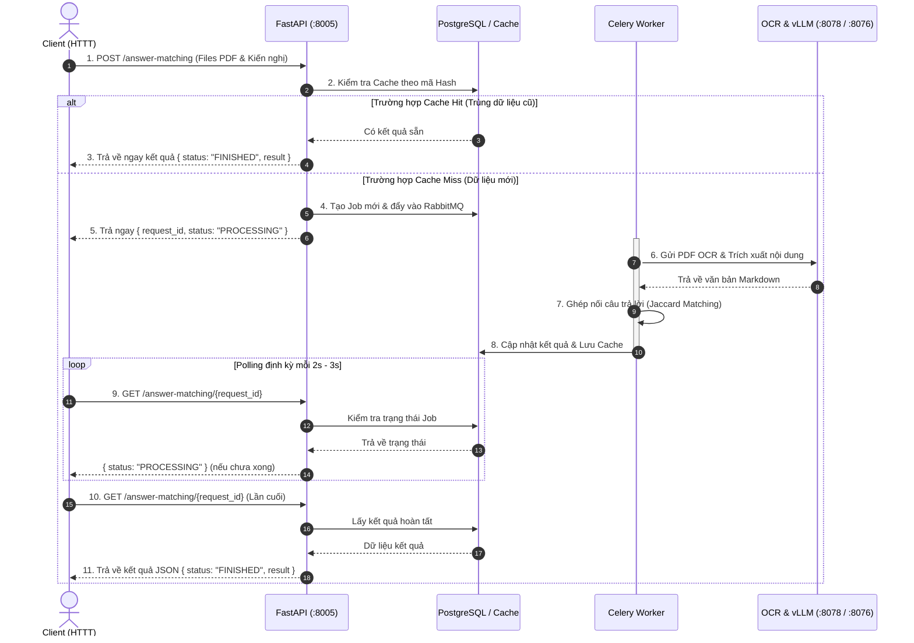
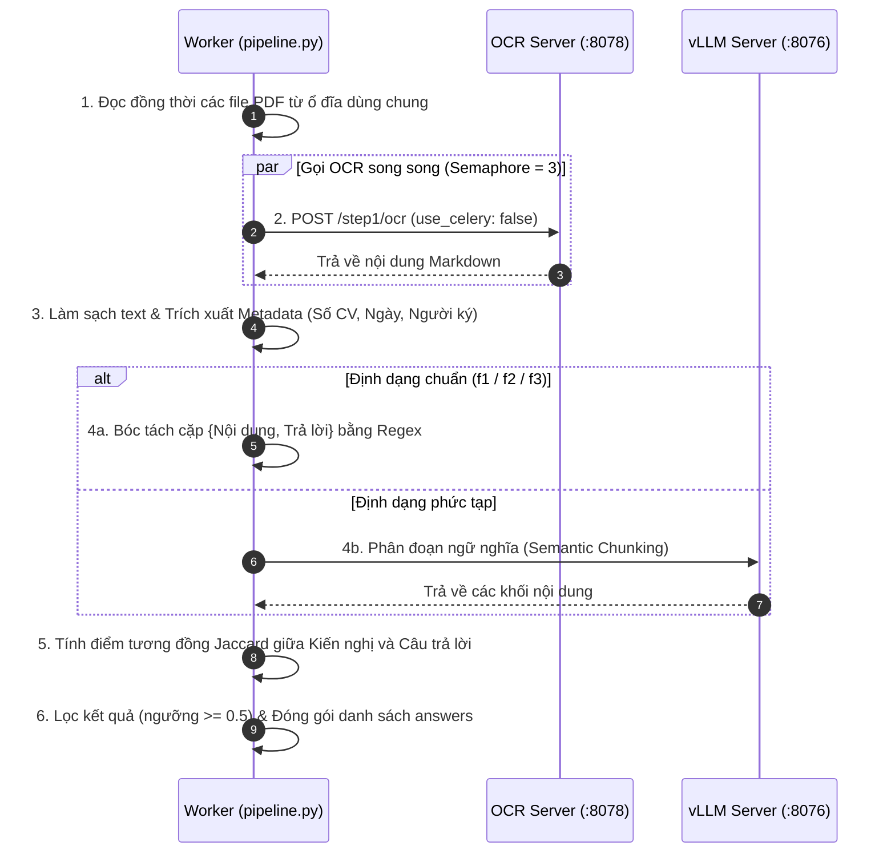

# SƠ ĐỒ HỆ THỐNG TỐI GIẢN (ANSWER MATCHING API V2)

> Tài liệu mô tả luồng hoạt động của hệ thống dưới dạng **Sequence Diagram tối giản**, trực quan và dễ theo dõi nhất.

---

## 1. SƠ ĐỒ TUẦN TỰ TỔNG QUAN (CORE SEQUENCE DIAGRAM)

---

## 2. SƠ ĐỒ TUẦN TỰ NỘI BỘ BƯỚC AI PIPELINE (PIPELINE SEQUENCE)

Biểu diễn tuần tự cách Worker bóc tách và ghép nối dữ liệu của từng Job:

---

## 3. TÓM TẮT 3 TRẠNG THÁI JOB

| Trạng thái | Ý nghĩa | Hành động của Client |
| :--- | :--- | :--- |
| **`PROCESSING`** | Job đang trong hàng đợi hoặc đang chạy OCR / Matching | Tiếp tục gọi polling sau 2-3s |
| **`FINISHED`** | Xử lý thành công, có object `result` kèm theo | Dừng polling, nhận câu trả lời |
| **`FAILED`** | Có lỗi xảy ra (file hỏng, lỗi mạng không thể phục hồi) | Dừng polling, hiển thị thông báo lỗi |
